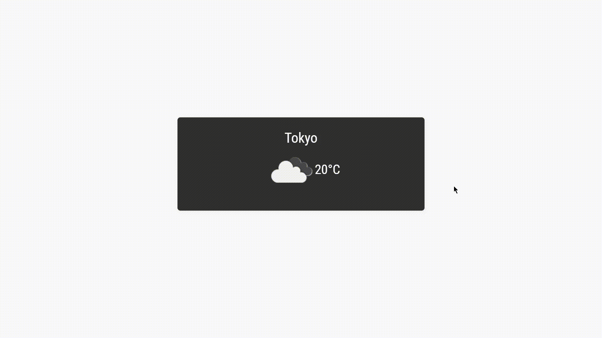

<h1 align="center">Weather Card</h1>

<p align="center">In this shorter <a href="https://reactjs.org">React</a> project I have created a weather card. It shows current weather based on user's geolocation. When clicked card will flip and show more info about current weather. The card is using <a href="https://openweathermap.org/api">OpenWeather API</a> for weather data.</p>


  
**Initial application and additional tools**
  
Creating react app 
  
```bash
npx create-react-app weather-card
```
  
<a href="https://momentjs.com">Moment</a> - date format
    
```bash
npm install moment --save
```

**Author**

<a href="https://github.com/Dreadsyl">Vladimir Jerković</a>
